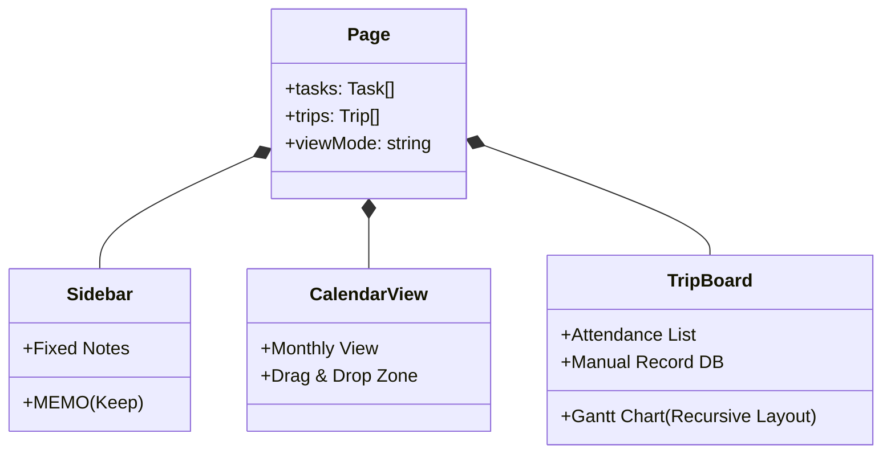

# 🏗️ Architecture & Data Flow Analysis

## 🔄 Core Data Flow

The application follows a **Unidirectional Data Flow** pattern, primarily driven by the `page.tsx` state container.

```mermaid
graph TD
    User[User Action] -->|Input/Click| Components
    Components -->|Callback| Page[page.tsx (State Container)]
    Page -->|setTasks/setTrips| State[React State]
    State -->|useEffect| Storage[LocalStorage]
    State -->|Props| Components
    
    subgraph "Data Sources"
        Manual[Manual Entry]
        Import[Clipboard Import]
        DragDrop[Drag & Drop]
    end
    
    Manual --> Page
    Import -->|Parse Logic| Page
    DragDrop -->|Merge Logic| Page
```

## 🧩 Component Hierarchy

The application is structured into three main functional areas managed by `page.tsx`.



## 💾 Data Persistence Strategy

**Storage Engine:** `window.localStorage`
**Keys:**
- `tasks`: Array of Task objects (Standard ToDo & Calendar items)
- `businessTrips`: Array of Trip objects (Attendance data)
- `manualTripRecords`: Array of ManualRecord objects (DB Tab data)
- `layoutState`: UI preferences (Sidebar open/close, Weekends show/hide)

## 🛠️ Key Technical Decisions

1.  **Zero-Backend Architecture**: All data lives in the client's LocalStorage for privacy and portability.
2.  **Absolute Inset vs Flexbox**:
    - *TripBoard Gantt*: Uses a **Relative Flexbox** layout with strict height passing to solve the "Infinite Height" scrolling bug.
    - *Reasoning*: CSS Grid and Absolute Positioning caused rendering artifacts (White Screen) in complex nested scrolling contexts.
    - *Constraints*: Relies on `flex-1 overflow-hidden relative` parent > `relative overflow-auto` child > `w-fit` content.
3.  **Parsers**:
    - `schedule-parser.ts`: Handles unstructured text parsing from clipboard (e.g., "홍길동 1/1~1/3 휴가").
    - `handleClipboardImport`: Specialized parser for Attendance Board tabular data (column detection + row mapping).

## 🚀 Recent Critical Fixes (Phase 8)

- **Scrollbar Visibility**: Fixed by reverting to `flex-1 h-full overflow-hidden` chain.
- **Data Visibility**: Disabled "Active Only" filter to preventing hiding imported data outside the current view range.
- **Header Mapping**: Added dynamic column mapping for Excel paste operations.
